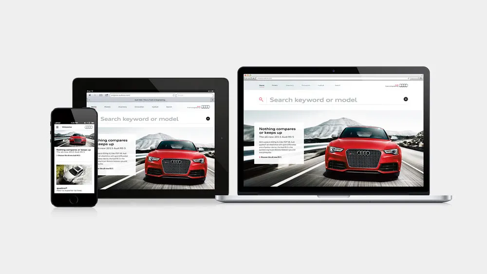

## Overview

<small>Image credit: AKQA</small>

In my time at AKQA, I worked on several different components of the website, including the car configurator, reusable carousels, navigations, shopping tools, bug fixes, and more. Our team was large and we were constantly iterating on improving the website. In addition to working on the existing site, my team and I created a prototype of the site using React in order to improve its performance and simplify the complex front-end.
