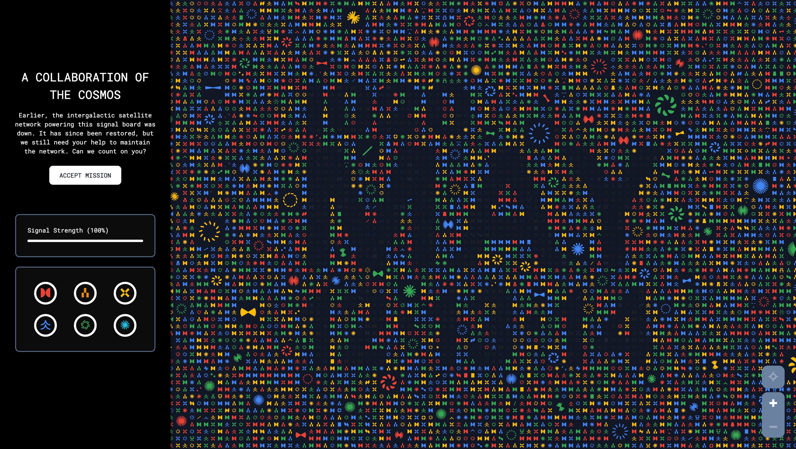

## Press

- [The Verge: pre-puzzle solve](https://www.theverge.com/2020/1/23/21078702/google-io-2020-developer-event-teaser-mission-game-puzzle-date)
- [The Verge: post-puzzle solve](https://www.theverge.com/2020/1/23/21079392/google-io-2020-date-announcement)
- [9to5Google](https://9to5google.com/2020/01/23/google-io-2020-puzzle/)
- [Android Police](https://www.androidpolice.com/2020/01/23/google-i-o-2020-teaser-is-a-collaborative-puzzle-well-have-to-solve-together/)
- [Gizmodo](https://www.gizmodo.com.au/2020/01/google-io-2020-date-location/)
- [Android Central](https://www.androidcentral.com/solve-puzzle-reveal-details-google-io-2020)
- [Pocket-Lint](https://www.pocket-lint.com/apps/news/google/150857-google-i-o-2020-is-coming-crack-the-puzzle-teasing-the-conference-dates)

<section class="flex-row">
<blockquote class="twitter-tweet">
. * * .🌙 * . * ☄️.  * . 🌍 * . * 💫 *   . * <a href="https://twitter.com/hashtag/GoogleIO?src=hash&amp;ref_src=twsrc%5Etfw">#GoogleIO</a> * .   * . is coming * ✨ *   . . * ✨ . * . * *  * 🌕 . . * ⭐️ * . *  Visit <a href="https://t.co/4Z0BwBPuco">https://t.co/4Z0BwBPuco</a> to discover more. <a href="https://t.co/hwsv3DDFGS">pic.twitter.com/hwsv3DDFGS</a>
&mdash; Google Developers (@googledevs) <a href="https://twitter.com/googledevs/status/1220360633293533185?ref_src=twsrc%5Etfw">January 23, 2020</a></blockquote>

<blockquote class="twitter-tweet">
Cosmos aligned. We&#39;ll be back at Shoreline Amphitheatre in Mountain View for this year&#39;s <a href="https://twitter.com/hashtag/GoogleIO?src=hash&amp;ref_src=twsrc%5Etfw">#GoogleIO</a> on May 12-14! <a href="https://t.co/3bZqriaoi1">pic.twitter.com/3bZqriaoi1</a>
&mdash; Sundar Pichai (@sundarpichai) <a href="https://twitter.com/sundarpichai/status/1220497572898340864?ref_src=twsrc%5Etfw">January 24, 2020</a></blockquote>
</section>

## Overview

The goal:

- Create a collaborative application where a player can solve a series of visual graph theory puzzles and cryptic questions in order to complete levels.

- Each level correlated with a particular shape, and after a level was completed, the player could choose to end the game and add that level's shape to the "signal wall," which was a large grid.

- Once each shape on the signal wall was unlocked, the wall animated to reveal a secret message: the dates for this year's conference (one that was unfortunately cancelled for reasons you probably know).

## Screengrabs

Timelapse of date reveal:

<iframe
title="Timelapse of date reveal"
src="https://player.vimeo.com/video/472362339?autoplay=1&loop=1&title=0&byline=0&portrait=0&muted=1" style="position:absolute;top:0;left:0;width:100%;height:100%;" frameborder="0" allow="autoplay; fullscreen" allowfullscreen title="Timelapse of date reveal"></iframe>

Last level gameplay example:

<iframe title="Last level gameplay example" src="https://player.vimeo.com/video/472362285?autoplay=1&loop=1&title=0&byline=0&portrait=0&muted=1" style="position:absolute;top:0;left:0;width:100%;height:100%;" frameborder="0" allow="autoplay; fullscreen" allowfullscreen title="Last level gameplay example"></iframe>

Date reveal and panning around canvas:

<iframe title="Date reveal and panning around canvas" src="https://player.vimeo.com/video/472362262?autoplay=1&loop=1&color=ffffff&title=0&byline=0&portrait=0&muted=1" style="position:absolute;top:0;left:0;width:100%;height:100%;" frameborder="0" allow="autoplay; fullscreen" allowfullscreen title="Date reveal and panning around canvas"></iframe>

Final date:

## Challenges and solutions

1. 
<em>Challenge</em>: Security - This app had to be <b>unhackable</b>!

   
As our players were almost entirely developers, this was no easy task since we had to think through all the possible backdoors that a developer might take in order to hack it.  Basically, *nothing* could be discoverable on the front-end, especially by an entire group of engineers who were trying to outsmart Google.

   
<em>Solution</em>: We used Firestore to store any backend data, and we used Firebase Cloud Functions to retrieve this data if the player's answer or solution was correct. Part of our game was solving visual puzzles, so even the solutions of those had to be hidden and could not be validated on the front-end.  In addition, we had strict Firebase Security Rules.
 

2. 
<em>Challenge</em>: State management

   
Our team of 6 developers decided to use the newly added Preact Hooks, a new method of managing state in React apps, which most of us were not familiar with initially. Not understanding the complexities at the time created some funky re-rendering and memory leaks, which we were luckily able to fix.

   
<em>Solution</em>: For any heavy state changes, we replaced Hooks with MobX, a state management library that more of us were familiar with and requires less boilerplate than something like Redux. We also removed any active event listeners whenever the component was unmounted.
 

3. 
<em>Challenge</em>: High number of users

   
We didn't have the luxury of time for this project, yet we had to still ensure that thousands of users (if not more) would be able to play this game, especially on the first day - both in terms of the load on the app's server and the Cloud Functions that were being called each time a user tried to answer a puzzle.

   
<em>Solution</em>: Load testing using <a href="https://loadster.app">Loadster</a> and increasing a variety of quotas on App Engine and Firebase.
 

4. 
<em>Challenge</em>: Process

   
We had to be scrappy with this project because of the timeline. We only had a few weeks to put together a fully-functioning, secure application, we had many developers collaborating at a time, and managing a complex project with multiple stakeholders was a challenge in itself. 

   
<em>Solutions</em>: 
    <ul>
        <li>Regularly merge in updates. Due to the speed we were working at, and because of the number of developers coding on this, we always had many code reviews open. We focused on having more senior developers review code regularly to unblock others.</li>
        <li>Communicate through a project-specific Slack channel and do daily standup video calls. </li>
        <li>Use Jira for project management and use Netlify or App Engine staging links for QA.</li>
    </ul>
   

## Credits

It took a lot of folks and groups to make this project happen:

- Development: [Left Field Labs](//leftfieldlabs.com)
  - Developers: Caliandra Harmon, Tom Slezakowski, Keren Megory-Cohen, Matt Masurka, Mikey Wagner, Daniel Hirsch
  - Producer: Elisha Kersey
  - QA: Altheria Weaver
- Design: [Instrument](//www.instrument.com/)
- Google Developer Marketing Team
