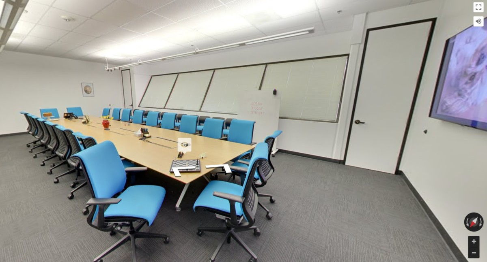

## Press

- [CNET](https://www.cnet.com/news/google-io-conference-2018-dates/)
- [The Verge](https://www.theverge.com/2018/1/24/16926960/google-io-developer-event-teaser-2018)
- [Beebom](https://beebom.com/google-io-2018-date-may-8-10/)
- [Mobile Scout](https://www.mobilescout.com/google/news/n103178/Google-IO-2018-website-encrypted-puzzles.html)
- [Digital Trends](https://www.digitaltrends.com/mobile/google-io-2018-date-revealed/)
- [NDTV](https://gadgets.ndtv.com/apps/news/google-teases-io-2018-developers-conference-street-view-may-8-10-1804230)

## Overview

Our team sent out an initial tweet with an enigmatic clue, a binary code that decodes to the URL for the game.

<section class="flex-row">
<blockquote class="twitter-tweet">
Plans are coming along for <a href="https://twitter.com/hashtag/io18?src=hash&amp;ref_src=twsrc%5Etfw">#io18</a>… <a href="https://t.co/48VpqvVqWU">pic.twitter.com/48VpqvVqWU</a>
&mdash; Google Developers (@googledevs) <a href="https://twitter.com/googledevs/status/956074091676688384?ref_src=twsrc%5Etfw">January 24, 2018</a></blockquote></section>
 

Then, players went through the escape room, where each room was part of the Google campus and had surrealist clues (i.e. one of the rooms was filled with yams to represent "may" backwards). In order to unlock the door to the next room, you were required to an answer to a cryptic question correctly or solve a puzzle. This experience engendered Discord chats and Twitter threads of eager developers looking to solve clues, which eventually was solved a few hours after the initial tweet.

Below is an example of a view of one of the rooms, where clicking on the eye icon brings up a modal with an additional clue or close up of the item.

 

 

You can read further in [this article that outlines the various rooms]().

## Contributors to the project

There were many key contributors to the project, including:

- Within Left Field Labs: My fellow developer and tech lead for the project, Fernando Guerrero, and our producer, Magali Devic
- Instrument, a design agency in Portland, created the idea, design, and helped produce the custom Google Maps
- The Google Developer Marketing team
