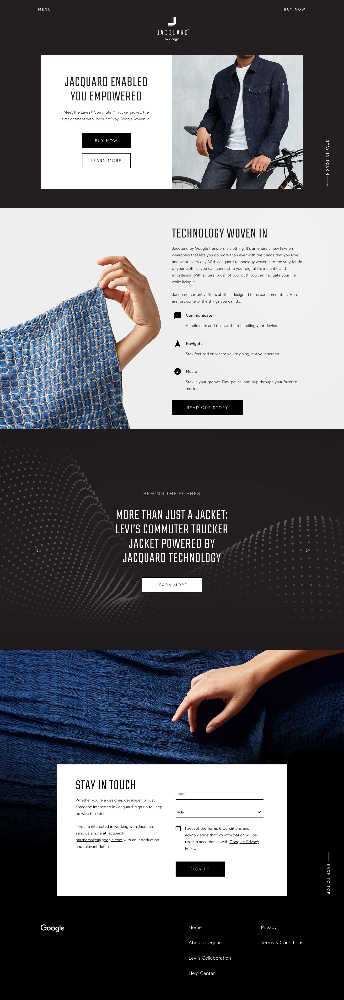

## Overview

My team included a designer, Amy Ni Pan, and two developers, Fernando Guerrero and myself. The main goal was simplicity and accessibility while maintaining a strong brand story. Though this site has since been redesigned, below are a few screenshots of our work.

## Accessibility lessons learned

Though I had been working on projects in the past where accessibility was a _part_ of the requirements, this was a first of many projects where it was accessibility-first. Too many times, we are under the pressure of a deadline which allows less 'visible' requirements to be shoved on the wayside. Though we had a similar short deadline for this project, making a website a11y-friendly was core to the brand, as Jacquard is wearable tech that has the potential to help folks with visual impairments through touch.

Below were my major takeaways for making a website accessible:

1. **Semantic HTML.** Not only does semantic HTML make code more readable, but it's necessary in order to alert screenreaders where links, buttons, and other important sections of a website are. So before you use an `<a>` for something that should be a `<button>`, consider how a screenreader would read it.

2. **Make dialogs easily escapable.** For the navigation, video player, and modals in this site, we had to make sure that someone could easily A) Escape it by pressing the `ESC` key, and B) Escape it by navigating to the close button.

3. **Use tabindex to ensure the right elements are focusable.** Sometimes, you might want to ensure a `
` is focusable, in case it's interactive but may be too large to be a button in itself. For this, you can add a higher `tabindex` to it, as only links and buttons have default tabindexes.

4. **Use your device's accessible mode rather than only testing through Chrome extensions** Though I think extensions like ChromeVox can be very useful for quick tests, they aren't as thorough or accurate as the actual accessibility apps on your mobile and desktop devices. That being said, there are many helpful Chrome extensions like WAVE that help spot obvious a11y issues, like missing a `title` attribute on your `iframe`.

5. **You can add hidden shortcuts for your screenreader users!** There are ways to add a hidden CTA to skip to the navigation or skip to the content, so it bypasses the repeated announcements at every new page.

6. **Design with accessibility in mind.** Not everything is able to be easily solved through JavaScript or HTML. In the design stages, you can ask yourselves a few questions to ensure that the site will be as easy to use with a screenreader than without one:

- Are we using colors that can be easily distinguishable by someone who is color-blind?
- Is there any interactivity that is superfluous? Does it easily work with a screenreader?
- Is the majority of our website images? Would the alt text of the images be enough to convey the message by someone using a screenreader?
- Does your navigation menu need to be hidden, or are there only a few links that can be visible at all times?
