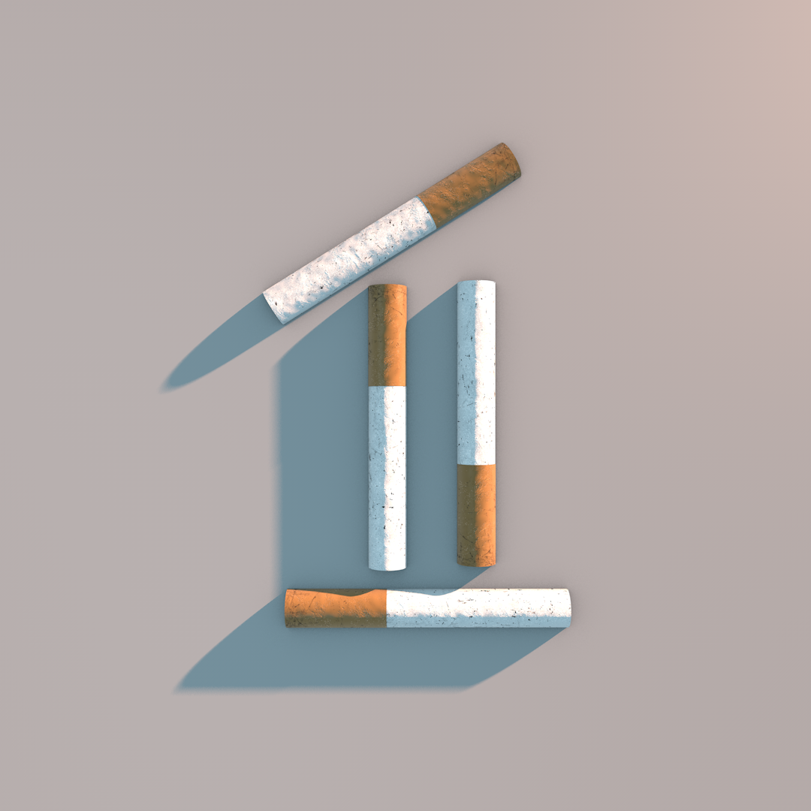

## 3D Art

In the past few years, I've been learning Cinema 4D and experimenting with a variety of techniques. I've also completed an Instagram challenge called #36DaysOfType focused on creating typography from A-Z and 0-9. Below is some of my 3D work.

 

    
    
    
    
    
    
    <video><source src="./anim/eye-to-hand.mp4" type="video/mp4"></video>

## Paintings

    
    
    
    
    
    
    <video><source src="./anim/eye-to-hand.mp4" type="video/mp4"></video>

